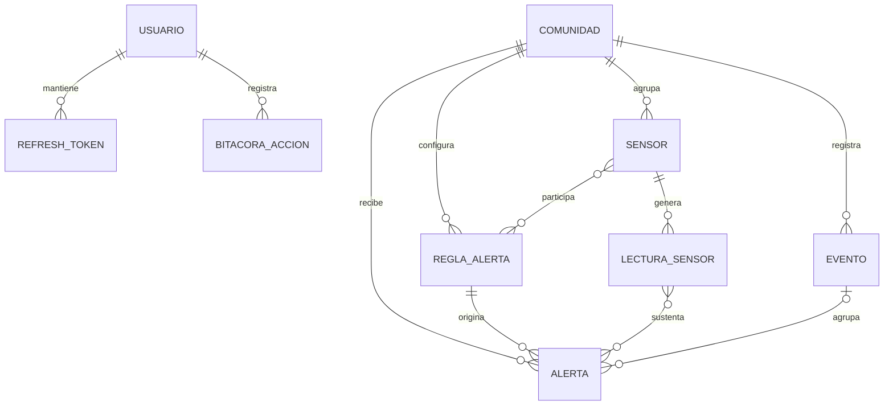

# Modelo conceptual del dominio

## Propósito

Este modelo define los conceptos y relaciones que orientarán la implementación del backend y la persistencia del Sistema Web de Monitoreo y Alerta Temprana para Riesgos Climáticos. No establece todavía tipos de datos ni detalles propios de SQL Server.

## Entidades principales

### Usuario

- **Responsabilidad:** representar a una persona autorizada para ingresar al sistema y realizar acciones según sus permisos.
- **Campos conceptuales:** identificador, nombre, correo o nombre de acceso, hash de contraseña, rol, estado y fechas de creación y último acceso.
- **Relaciones:** posee sesiones mediante `RefreshToken` y puede originar registros en `BitacoraAccion`.
- **Historial:** se conservan sus acciones relevantes, cambios de estado y sesiones emitidas o revocadas.

### Comunidad

- **Responsabilidad:** representar la comunidad donde se monitorean condiciones climáticas y ambientales.
- **Campos conceptuales:** identificador, nombre, ubicación o referencia geográfica, descripción y estado.
- **Relaciones:** agrupa sensores, reglas de alerta, alertas y eventos.
- **Historial:** se conservan las lecturas, alertas y eventos asociados, aunque cambien sus datos descriptivos.

### Sensor

- **Responsabilidad:** identificar una fuente de medición simulada o un dispositivo físico.
- **Campos conceptuales:** identificador, código del dispositivo, nombre, tipo de variable medida, origen `Simulated` o `Physical`, estado activo o inactivo, ubicación y última comunicación.
- **Relaciones:** pertenece a una comunidad, genera lecturas y puede estar asociado con reglas de alerta.
- **Historial:** se conservan sus lecturas, cambios de estado, origen, asociaciones y comunicaciones relevantes.

### LecturaSensor

- **Responsabilidad:** registrar una medición recibida desde un sensor.
- **Campos conceptuales:** identificador, variable medida, valor, unidad, fecha y hora de la lectura, fecha de recepción y origen `Simulated` o `Physical`. Las variables contempladas son temperatura, humedad relativa, velocidad del viento, nivel de lluvia y nivel de río o reservorio.
- **Relaciones:** pertenece a un sensor y puede participar en la evaluación que origine o actualice alertas.
- **Historial:** cada lectura se conserva como registro histórico y no se reemplaza con la lectura más reciente.

### ReglaAlerta

- **Responsabilidad:** definir las condiciones configurables con las que se evalúan las lecturas y se determina un nivel de peligro.
- **Campos conceptuales:** identificador, fenómeno, variable evaluada, condición, umbral configurable, nivel de peligro, vigencia y estado.
- **Relaciones:** se configura para una comunidad y puede aplicarse a un tipo de sensor o sensor específico; su evaluación puede generar alertas.
- **Historial:** se conservan sus cambios, periodos de vigencia y la regla utilizada en cada evaluación relevante.

### Alerta

- **Responsabilidad:** representar una condición de riesgo detectada, darle seguimiento y mantener su estado actual.
- **Campos conceptuales:** identificador, fenómeno, nivel de peligro, estado, fecha de detección, última actualización, mensaje y fecha de cierre.
- **Relaciones:** pertenece a una comunidad, surge de la evaluación de reglas y lecturas, y puede relacionarse con un evento.
- **Historial:** se conservan los cambios de nivel, estado, mensajes y momentos de apertura, actualización y cierre.

### Evento

- **Responsabilidad:** registrar históricamente un incidente ocurrido y su evolución, más allá del estado operativo de una alerta.
- **Campos conceptuales:** identificador, fenómeno, descripción, fecha y hora de inicio, fecha y hora de finalización, nivel alcanzado y estado.
- **Relaciones:** pertenece a una comunidad y puede estar vinculado con una o más alertas y acciones registradas.
- **Historial:** el evento forma parte del historial permanente del incidente y conserva su cronología y resultado.

### BitacoraAccion

- **Responsabilidad:** dejar evidencia de acciones relevantes realizadas dentro del sistema.
- **Campos conceptuales:** identificador, acción, descripción, fecha y hora, usuario responsable, entidad afectada y referencia del registro afectado.
- **Relaciones:** normalmente pertenece a un usuario y puede referirse a sensores, reglas, alertas, eventos u otros registros.
- **Historial:** sus entradas son históricas y no deben sobrescribirse.

### RefreshToken

- **Responsabilidad:** mantener sesiones renovables de forma controlada y permitir su revocación.
- **Campos conceptuales:** identificador, valor protegido, fecha de emisión, vencimiento, revocación y motivo de revocación.
- **Relaciones:** pertenece a un usuario.
- **Historial:** se conservan la emisión, uso, vencimiento y revocación necesarios para seguimiento de seguridad.

## Alerta y evento

Una **Alerta** expresa una condición de riesgo detectada y mantiene su nivel y estado operativo mientras se evalúa la situación. Puede actualizarse o cerrarse conforme llegan nuevas lecturas.

Un **Evento** documenta el incidente ocurrido como parte del historial de la comunidad. Conserva su desarrollo y resultado, incluso después de cerrar las alertas relacionadas.

## Diagrama entidad-relación conceptual

